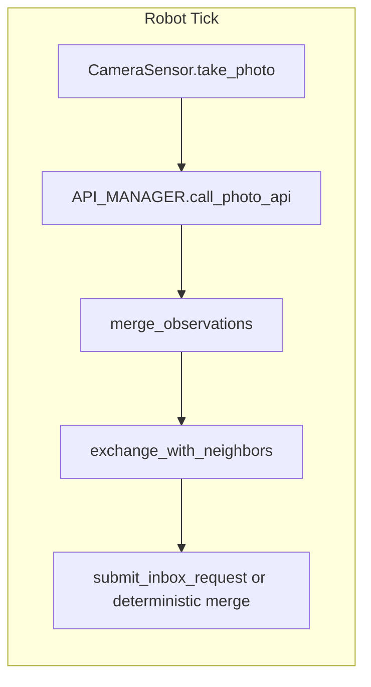
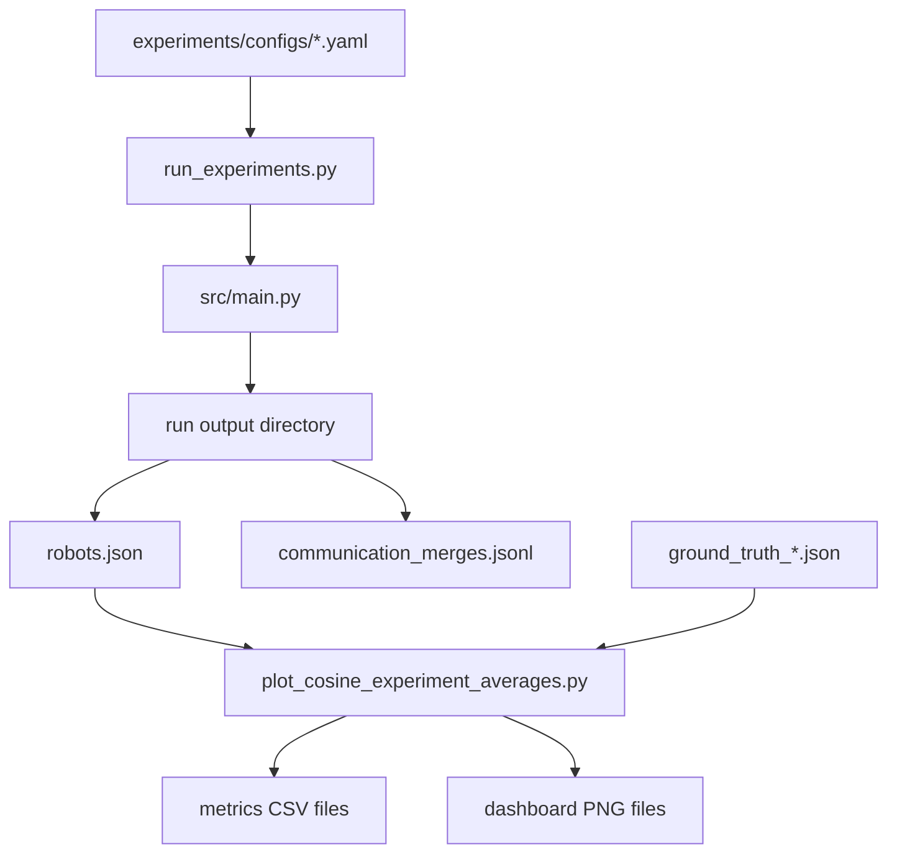
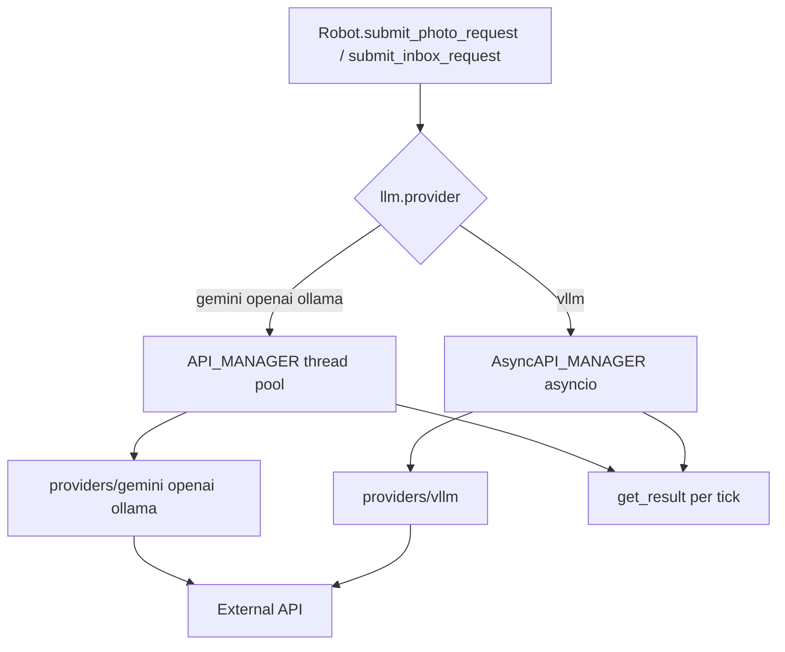

# Architecture

The runtime follows a decentralized swarm model. Each robot maintains its own language-based knowledge base and updates it from local sensing and nearby peer communication.

## Agent Loop

## Main Components

- **Simulation runtime**
  - `src/main.py` initializes config, constants, the simulation object, and spawns robots.
  - `Robot.update()` executes sensing, communication, inbox budgeting, and async result polling.
- **Perception and movement**
  - `src/camera_sensor.py` crops a local view and renders sensing overlays.
  - `src/actuator.py` applies linear and angular commands to robot pose.
- **Knowledge and logging**
  - `src/llm/factory.py` selects a provider from `llm.provider` and returns either `API_MANAGER` (threaded) or `AsyncAPI_MANAGER` (vLLM).
  - `src/llm/providers/` implements `gemini`, `openai`, `ollama`, and `vllm` backends behind a shared `LLMProvider` protocol.
  - `src/observation_logger.py` stores `robots.json` snapshots and optional artifacts.
- **Experiment and evaluation**
  - `experiments/run_experiments.py` executes comm/noncomm config pairs across seeds.
  - `experiments/metrics/plot_cosine_experiment_averages.py` computes recall, precision, F1, then writes CSV/plot outputs.

## Shared Data Flow

## LLM Layer

| Module | Responsibility |
|--------|----------------|
| `llm/factory.py` | `create_api_manager(n_threads, config)` — wires provider to manager |
| `llm/manager.py` | Threaded queue, stale-request dropping, prompt building |
| `llm/async_manager.py` | Non-blocking parallel HTTP for vLLM |
| `llm/providers/base.py` | `generate_text` / `generate_vision` protocol |
| `llm/providers/*.py` | Provider-specific API clients |

See [Configuration](configuration.md) for all YAML keys.
