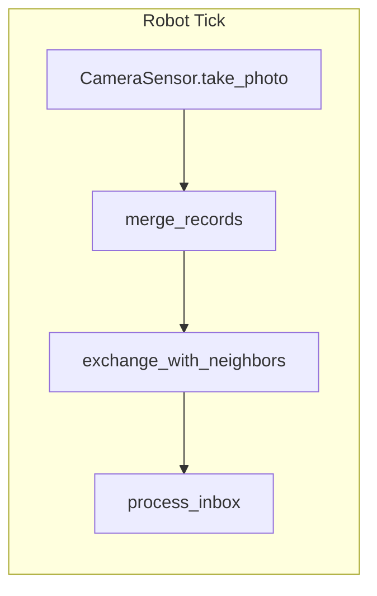
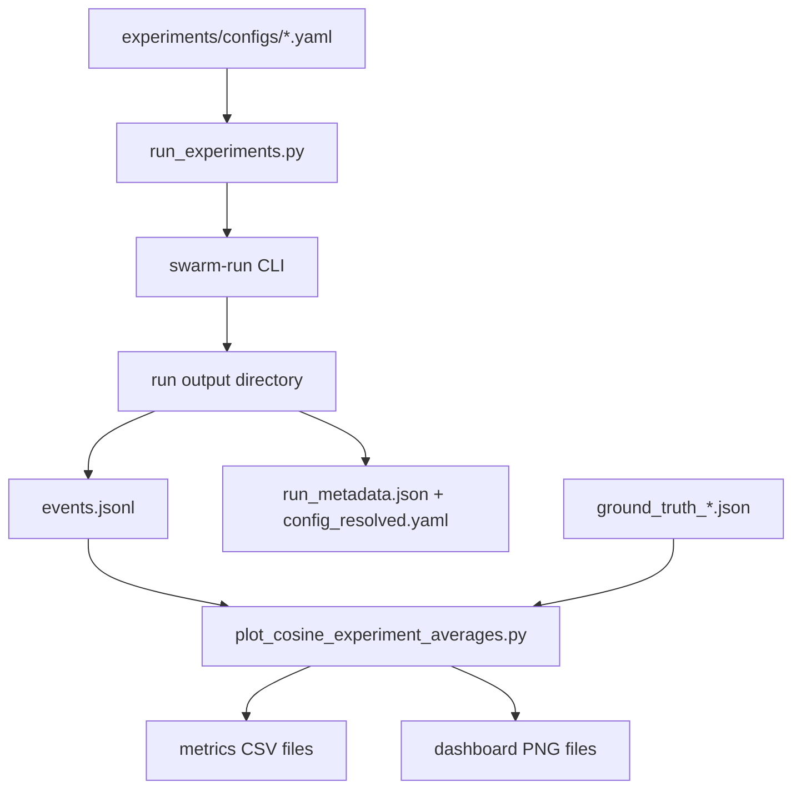

# Architecture

The runtime follows a decentralized swarm model. Each robot maintains its own capped memory of capture records and updates it from local sensing and nearby peer communication.

## Agent Loop

## Main Components

- **Simulation runtime**
  - `src/swarm_perception/cli.py` parses the config path and override flags, then wires and runs the engine.
  - `src/swarm_perception/sim/engine.py` selects the windowed or headless violet base and registers the shared per-run services.
  - `Robot.update()` in `src/swarm_perception/sim/robot.py` executes sensing, record memory, and inbox budgeting.
- **Perception and movement**
  - `src/swarm_perception/camera_sensor.py` crops a local view and renders sensing overlays.
  - `src/swarm_perception/sim/actuator.py` applies linear and angular commands to robot pose.
- **Configuration and logging**
  - `src/swarm_perception/config/` parses YAML into validated frozen dataclasses.
  - `src/swarm_perception/io/run_logger.py` appends `events.jsonl` and writes the reproducibility artifacts.
- **Experiment and evaluation**
  - `experiments/run_experiments.py` executes comm/noncomm config pairs across seeds.
  - `experiments/metrics/plot_cosine_experiment_averages.py` computes recall, precision, F1, then writes CSV/plot outputs.

## Shared Data Flow

See [Configuration](configuration.md) for all YAML keys.
