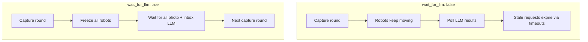

# Configuration Reference

Simulation behavior is controlled by a single YAML file passed to `swarm-run` (or `python -m swarm_perception`). The loader (`swarm_perception.utils.config.SwarmConfig`) converts nested keys into dot-access namespaces (for example, `config.robot.coverage_side`).

Start from the ready-made samples in `examples/`.

## Top-Level Structure

```yaml
config:
  name: "my_run"

simulation:
  # world size, timing, assets, output

robot:
  # motion, sensing, communication, LLM sync behavior

llm:
  # provider, model, concurrency, prompts
```

---

## `config`

| Key | Type | Default | Description |
|-----|------|---------|-------------|
| `name` | string | *(required)* | Short label used in output directory names and experiment logs. |

---

## `simulation`

Controls the pygame world, run duration, and artifact saving.

| Key | Type | Default | Description |
|-----|------|---------|-------------|
| `run_length` | int | — | Number of **capture epochs** per run. Each epoch is one photo round for all robots; this value drives plot progression length in metrics. |
| `headless` | bool | `false` | When `true`, runs without a visible UI window. Robot crops are still captured and sent to the LLM. |
| `width` | int | — | Simulation world width in pixels. |
| `height` | int | — | Simulation world height in pixels. |
| `fps` | int | — | Simulation ticks per real second. Set `0` for uncapped headless speed. |
| `num_of_robots` | int | — | Number of robots spawned at startup. |
| `background_image` | string | — | Filename under `src/assets/` for the environment image. |
| `robot_image` | string | — | Filename under `src/assets/` for the robot sprite. |
| `seed` | int | — | Random seed for reproducible placement and motion. |
| `save_photo_frames` | bool | `false` | Save one full-scene PNG per capture epoch to `run_output/frames/`. Requires an active pygame display surface (typically **not** headless). |
| `save_robot_crops` | bool | `false` | Save each robot's cropped camera image per epoch to `run_output/robot_crops/`. Works in headless and windowed modes. |
| `output_dir` | string | `output/` | Override the run output root. `experiments/run_experiments.py` sets this per job automatically. |

### Derived timing

The runtime computes:

- `PHOTO_TICKS = capture_frequency * fps` — ticks between capture rounds
- `SIM_DURATION = run_length * PHOTO_TICKS` — total simulation length in ticks

---

## `robot`

Controls movement, sensing geometry, peer communication, and how robots wait on LLM responses.

| Key | Type | Default | Description |
|-----|------|---------|-------------|
| `linear_speed` | float | — | Forward movement speed per simulation tick. |
| `angular_velocity` | float | — | Turn rate used for edge-avoidance corrections. |
| `coverage_side` | int | — | Side length (pixels) of the square camera crop. Maps to paper sensing radius **R**. |
| `neighbor_radius` | int | — | Distance threshold for detecting neighboring robots. Maps to paper communication range **C**. |
| `capture_frequency` | float | — | Simulated **seconds** of movement between capture rounds (when `fps > 0`). |
| `communication` | bool | — | Enable (`true`) or disable (`false`) peer-to-peer message exchange. |
| `self_learning` | bool | — | `true` uses `photo_analysis_self_learning` (memory-aware photo prompt). `false` uses the image-only prompt. |
| `empty_observation` | string | — | Initial placeholder text before the first photo LLM result arrives. |
| `max_facts_per_observation` | int | `40` | Hard cap on stored fact sentences after deterministic merge. |
| `use_llm_inbox_synthesis` | bool | `true` | `true` queues LLM inbox merge requests. `false` uses deterministic `merge_observations` only. |
| `no_inbox_synthesis` | bool | — | **Legacy alias.** Inverted by `use_llm_inbox_synthesis` when the newer key is absent. |
| `max_inbox_merges_per_epoch` | int | `1` | Per-robot budget of LLM inbox merges per capture epoch. |
| `inbox_merge_after_budget` | string | `"drop"` | Behavior when the merge budget is exhausted: `"drop"` (ignore new peers), `"deterministic"` (rule-based merge), or `"llm"` (allow more LLM merges). |
| `save_comm_merge_history` | bool | `false` | Append successful peer merges to `communication_merges.jsonl`. |
| `wait_for_llm` | bool | `false` | **Epoch sync mode.** When `true`, the swarm freezes after each capture batch until all in-flight photo and inbox LLM responses return. Timeouts are disabled. |
| `wait_for_photo_llm` | bool | — | **Legacy alias** for `wait_for_llm`. Either key enables epoch sync. |
| `photo_timeout_ticks` | int | `PHOTO_TICKS * 2` | **Async mode only.** Drop a stalled photo LLM request after this many ticks (~`seconds * fps`). Ignored when `wait_for_llm` is `true`. |
| `inbox_timeout_ticks` | int | `PHOTO_TICKS` | **Async mode only.** Drop a stalled inbox LLM request after this many ticks. Ignored when `wait_for_llm` is `true`. |

### Async vs epoch-sync LLM behavior



---

## `llm`

Selects the backend, model, concurrency, and prompt templates.

| Key | Type | Default | Description |
|-----|------|---------|-------------|
| `provider` | string | `"gemini"` | Backend: `gemini`, `openai`, `ollama`, or `vllm`. See [LLM Providers](llm-providers.md). |
| `model_name` | string | — | Model identifier passed to the provider (API model name, Ollama tag, or vLLM served name). |
| `thread_workers` | int | — | Concurrency limit. For `gemini`/`openai`/`ollama`: worker threads in `API_MANAGER`. For `vllm`: max parallel in-flight async HTTP requests. |
| `temperature` | float | `0.05` | Sampling temperature for generation. |
| `max_output_tokens` | int | `220` | Maximum tokens per completion (`gemini`, `openai`, `vllm`). Ollama uses temperature only via its `options` payload. |
| `base_url` | string \| null | provider-specific | Override API endpoint. See provider defaults in [LLM Providers](llm-providers.md). |
| `api_key_env` | string | provider-specific | Name of the environment variable holding the API key. Ollama ignores this. |
| `request_timeout_seconds` | float | `600` | **vLLM only.** Per-request HTTP timeout in seconds. |
| `max_connections` | int | `thread_workers` | **vLLM only.** httpx connection pool size. Defaults to `thread_workers` when unset or `0`. |

### `llm.prompts`

Three prompt templates are formatted at runtime:

| Key | Placeholders | Used when |
|-----|--------------|-----------|
| `photo_analysis_self_learning` | `{observation}` | `robot.self_learning: true` |
| `photo_analysis_no_self_learning` | *(none)* | `robot.self_learning: false` |
| `text_synthesis` | `{current_observation}`, `{inbox}` | `robot.use_llm_inbox_synthesis: true` |

Prompts are plain multi-line strings. Use Python `str.format` syntax for placeholders.

---

## Provider-Specific Defaults

| Provider | Default `api_key_env` | Default `base_url` | Manager |
|----------|----------------------|-------------------|---------|
| `gemini` | `GOOGLE_API_KEY` | — | `API_MANAGER` (threaded) |
| `openai` | `OPENAI_API_KEY` | OpenAI API | `API_MANAGER` (threaded) |
| `ollama` | *(unused)* | `http://localhost:11434` | `API_MANAGER` (threaded) |
| `vllm` | `OPENAI_API_KEY` (falls back to `"EMPTY"`) | `http://localhost:8080/v1` | `AsyncAPI_MANAGER` (asyncio) |

---

## Environment Variables

Create a `.env` file in the repository root (loaded by Gemini, OpenAI, and vLLM providers):

```bash
GOOGLE_API_KEY=your_google_key      # gemini
OPENAI_API_KEY=your_openai_key      # openai, vllm (or OPENAI_API_KEY=EMPTY for local vLLM)
```

Ollama does not require an API key.

---

## Related Files

| Path | Purpose |
|------|---------|
| `examples/example1.yaml` | Ollama sample |
| `examples/example1_vllm.yaml` | vLLM sample |
| `examples/example1_gemini.yaml` | Gemini sample |
| `examples/example1_openai.yaml` | OpenAI sample |
| `experiments/configs/` | Experiment-scale configs (comm/noncomm pairs, HPC vLLM) |
