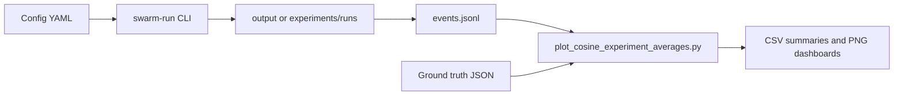

# Environmental Perception Docs

This documentation covers the implementation in `src/` and `experiments/` for the capstone project, *Environmental Perception in a Swarm of Conversational Agents*.

## What This Site Contains

- Architecture and data flow from simulation to evaluation metrics
- **[Configuration reference](configuration.md)** — every YAML key explained
- Methodology mapping between paper concepts and concrete code modules
- Experiment orchestration and metrics pipeline usage
- Auto-generated API reference from in-code docstrings

## Quick Links

- Project README: `README.md`
- Run entrypoint: `swarm-run` (`src/swarm_perception/cli.py`)
- Example configs: `examples/example1.yaml`
- Batch runner: `experiments/run_experiments.py`
- Metrics script: `experiments/metrics/plot_cosine_experiment_averages.py`

## High-Level Workflow

