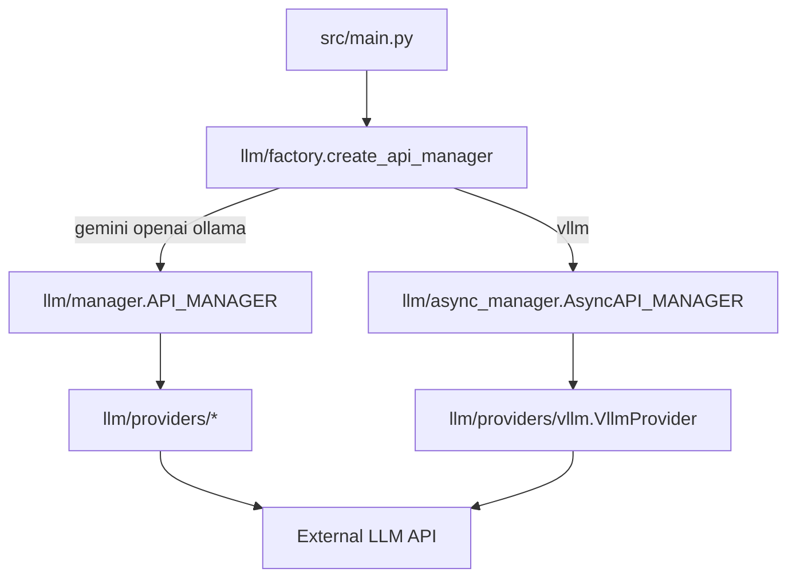

# LLM Providers

The swarm routes all photo analysis and inbox synthesis through a pluggable provider layer under `src/llm/`. Configuration selects the backend via `llm.provider` in your YAML file.

## Architecture



### Module roles

| Module | Role |
|--------|------|
| `llm/factory.py` | Reads `config.llm.provider` and constructs the correct manager + provider. |
| `llm/manager.py` | Thread-pool request queue for Gemini, OpenAI, and Ollama. Drops stale requests per robot. |
| `llm/async_manager.py` | Asyncio dispatcher for vLLM with a semaphore capped at `thread_workers`. |
| `llm/providers/base.py` | `LLMProvider` protocol: `generate_text` and `generate_vision`. |
| `llm/providers/gemini.py` | Google Generative AI SDK. Includes client-side rate limiting. |
| `llm/providers/openai_provider.py` | OpenAI chat completions (text + vision). |
| `llm/providers/ollama.py` | Local Ollama `/api/generate` HTTP endpoint. |
| `llm/providers/vllm.py` | Async httpx client for vLLM's OpenAI-compatible `/v1/chat/completions`. |

Use `swarm_perception.llm.factory.create_api_manager` to construct a provider-backed manager.

### Request flow

1. Each robot calls `submit_photo_request` or `submit_inbox_request` on the shared manager.
2. Workers (threads or asyncio tasks) call the provider's `generate_vision` or `generate_text`.
3. Robots poll `get_result(robot_id, "photo"|"inbox")` each tick.
4. On failure, the manager falls back to the robot's current observation so the simulation continues.

Set `thread_workers` to at least the number of robots for best throughput. For vLLM on GPU, match `thread_workers` to how many parallel requests your server can handle.

---

## Gemini (cloud)

Best for quick experiments with Google's multimodal API. Requires a vision-capable model (for example `gemini-2.5-flash-lite`).

### Prerequisites

```bash
# .env
GOOGLE_API_KEY=your_key_here
```

### Minimal config

```yaml
llm:
  provider: "gemini"
  model_name: "gemini-2.5-flash-lite"
  thread_workers: 10
  temperature: 0.05
  max_output_tokens: 220
  api_key_env: "GOOGLE_API_KEY"
```

### Run

```bash
python src/main.py examples/example1_gemini.yaml
```

### Notes

- `base_url` is not used.
- The Gemini provider enforces a client-side rate limit (~3900 requests per 60 seconds).
- Photo crops are sent as PIL images; inbox merges are text-only.

---

## OpenAI (cloud)

Uses the official OpenAI Python SDK. Supports GPT-4o and other vision models via chat completions.

### Prerequisites

```bash
# .env
OPENAI_API_KEY=sk-...
```

### Minimal config

```yaml
llm:
  provider: "openai"
  model_name: "gpt-4o-mini"
  thread_workers: 10
  temperature: 0.05
  max_output_tokens: 220
  api_key_env: "OPENAI_API_KEY"
  # base_url: null   # optional: OpenAI-compatible proxy (Azure, LiteLLM, etc.)
```

### Run

```bash
python src/main.py examples/example1_openai.yaml
```

### Using a compatible proxy

Set `base_url` to your proxy's OpenAI-compatible root (for example `https://my-proxy.example.com/v1`):

```yaml
llm:
  provider: "openai"
  model_name: "gpt-4o-mini"
  base_url: "https://my-proxy.example.com/v1"
  api_key_env: "OPENAI_API_KEY"
```

---

## Ollama (local)

Runs inference on your machine via [Ollama](https://ollama.com/). No API key required. The model must support vision for photo analysis.

### Prerequisites

```bash
# Install Ollama, then pull a vision model
ollama pull qwen3.5:4b   # example; use any vision-capable tag
ollama serve             # default: http://localhost:11434
```

### Minimal config

```yaml
llm:
  provider: "ollama"
  model_name: "qwen3.5:4b"
  thread_workers: 10
  temperature: 0.05
  base_url: "http://localhost:11434"
```

### Run

```bash
python src/main.py examples/example1.yaml
```

### Notes

- `api_key_env` and `max_output_tokens` are ignored by the Ollama provider.
- Requests use `POST /api/generate` with `stream: false`.
- For remote Ollama (another host on your LAN), set `base_url` to that host's URL.
- Local models are slower than cloud APIs; consider `wait_for_llm: true` and a lower `num_of_robots` while testing.

---

## vLLM (local / HPC)

Targets a [vLLM](https://docs.vllm.ai/) server exposing the OpenAI-compatible REST API. Uses `AsyncAPI_MANAGER` so multiple HTTP requests run in parallel without blocking each other—important for GPU batching on clusters.

### Prerequisites

Start vLLM with an OpenAI-compatible server (example):

```bash
# Example: serve a vision model on port 8080
vllm serve google/gemma-3-12b-it --port 8080
```

```bash
# .env — vLLM often accepts any bearer token
OPENAI_API_KEY=EMPTY
```

### Minimal config

```yaml
robot:
  wait_for_llm: true   # recommended for local inference latency

llm:
  provider: "vllm"
  model_name: "google/gemma-3-12b-it"   # must match --served-model-name
  thread_workers: 10                    # max parallel in-flight requests
  temperature: 0.05
  max_output_tokens: 220
  base_url: "http://localhost:8080/v1"
  request_timeout_seconds: 600
  api_key_env: "OPENAI_API_KEY"
  # max_connections: 10               # optional; defaults to thread_workers
```

### Run

```bash
python src/main.py examples/example1_vllm.yaml
```

### HPC / remote server

Point `base_url` at your cluster node:

```yaml
llm:
  provider: "vllm"
  model_name: "google/gemma-4-12B-it"
  base_url: "http://gpu-node.internal:8080/v1"
  thread_workers: 10
  request_timeout_seconds: 600
```

See `experiments/configs/local-hpc-2500/` for full experiment-scale configs.

### Notes

- The model must support vision (image URL in chat messages) for photo analysis.
- `thread_workers` controls asyncio concurrency, not OS threads.
- `max_connections` sizes the httpx connection pool (defaults to `thread_workers`).
- Use `wait_for_llm: true` when epoch-aligned results matter more than continuous motion.

---

## Choosing a Provider

| Provider | Best for | API key | Vision | Concurrency model |
|----------|----------|---------|--------|-------------------|
| `gemini` | Fast cloud experiments, capstone defaults | `GOOGLE_API_KEY` | Yes | Thread pool |
| `openai` | GPT-family models, Azure/proxy via `base_url` | `OPENAI_API_KEY` | Yes | Thread pool |
| `ollama` | Laptop / dev machine, no cloud cost | None | Model-dependent | Thread pool |
| `vllm` | GPU server or HPC, high parallelism | Optional (`EMPTY`) | Model-dependent | Async HTTP |

---

## Troubleshooting

| Symptom | Likely cause | Fix |
|---------|--------------|-----|
| `KeyError` on startup | Missing API key env var | Set the variable named in `api_key_env` in `.env` |
| Photo LLM never completes (async mode) | Timeout too low | Increase `photo_timeout_ticks` or enable `wait_for_llm` |
| Ollama connection refused | Server not running | Run `ollama serve` or fix `base_url` |
| vLLM 404 / wrong model | `model_name` mismatch | Match vLLM's served model name exactly |
| Empty or failed vision output | Non-vision model | Use a multimodal model tag |
| Rate limit errors (Gemini) | Too many parallel requests | Lower `thread_workers` or `num_of_robots` |

For the full list of simulation and robot keys, see [Configuration Reference](configuration.md).
