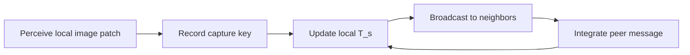

# Methodology Mapping (Paper to Code)

This page maps Section 3 of the capstone paper to the implementation.

## Terminology Mapping

| Paper term | Code implementation |
|---|---|
| Knowledge Base (`T_s`) | `Robot.memory` in `src/swarm_perception/sim/robot.py` |
| Interpretation (individual learning) | `Robot.update()` capture path: one record per own camera capture |
| Integration (social learning) | `Robot.process_inbox()` key-union merge in `src/swarm_perception/sim/robot.py` |
| Camera patch (`R x R`) | `CameraSensor.take_photo()` with `coverage_side` in `src/swarm_perception/camera_sensor.py` |
| Communication range (`C`) | `neighbor_radius` and proximity lookup in `Robot.exchange_with_neighbors()` |
| Snapshot history | `memory` events written by `src/swarm_perception/io/run_logger.py` |
| Recall/Precision/F1 metrics | `score_observation_metrics()` in `experiments/metrics/plot_cosine_experiment_averages.py` |

## Runtime Loop

## Important Implementation Notes

- The inbox is a bounded FIFO of at most 8 pending broadcasts; when full, the oldest queued broadcast is dropped.
- Robots attempt neighbor communication every tick when they are in range.
- Inbox merges are budgeted per capture epoch by `max_inbox_merges_per_epoch`.
- After budget is reached, behavior is controlled by `inbox_merge_after_budget` (`drop` or `deterministic`).
- Merges are key-union: records whose `(epoch, robot, crop_idx)` key is already present are ignored, and `memory_cap` truncates deterministically.
- `simulation.headless: true` runs without a visible UI window while keeping robot crop capture active, and executes flat-out with no wall-clock pacing.
- `simulation.save_photo_frames` depends on an active pygame display surface; `simulation.save_robot_crops` works in both headless and non-headless runs.

## Experiment Configuration Knobs

Primary keys live in the YAML files under `experiments/configs/` and `examples/`. See the full [Configuration Reference](configuration.md) for defaults and behavior.

Key experiment levers:

- `simulation.run_length`, `simulation.fps`, `simulation.num_of_robots`
- `robot.coverage_side`, `robot.neighbor_radius`, `robot.capture_frequency`
- `robot.communication`, `robot.memory_cap`, `robot.max_inbox_merges_per_epoch`
