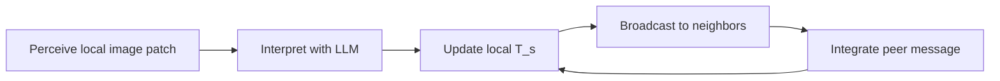

# Methodology Mapping (Paper to Code)

This page maps Section 3 of the capstone paper to the implementation.

## Terminology Mapping

| Paper term | Code implementation |
|---|---|
| Knowledge Base (`T_s`) | `Robot.current_observation` in `src/main.py` |
| Interpretation (individual learning) | `submit_photo_request()` + `call_photo_api()` in `src/llm/llm_api_gemini.py` |
| Integration (social learning) | `submit_inbox_request()` / `call_inbox_api()` or deterministic fallback merge in `src/main.py` |
| Camera patch (`R x R`) | `CameraSensor.take_photo()` with `coverage_side` in `src/camera_sensor.py` |
| Communication range (`C`) | `neighbor_radius` and proximity lookup in `Robot.exchange_with_neighbors()` |
| Snapshot history | `ObservationLogger.log_progress_snapshot()` in `src/observation_logger.py` |
| Recall/Precision/F1 metrics | `score_observation_metrics()` in `experiments/metrics/plot_cosine_experiment_averages.py` |

## Runtime Loop

## Important Implementation Notes

- The inbox is effectively single-slot: newer pending messages replace older pending ones.
- Robots attempt neighbor communication every tick when they are in range.
- Inbox merges are budgeted per capture epoch by `max_inbox_merges_per_epoch`.
- After budget is reached, behavior is controlled by `inbox_merge_after_budget` (`drop`, `deterministic`, or `llm`).
- A deterministic text merge helper (`merge_observations`) always runs before final storage to de-duplicate and cap facts.

## Experiment Configuration Knobs

Primary keys live in the YAML files under `experiments/configs/`:

- `simulation.run_length`, `simulation.fps`, `simulation.num_of_robots`
- `robot.coverage_side`, `robot.neighbor_radius`, `robot.capture_frequency`
- `robot.communication`, `robot.self_learning`, `robot.use_llm_inbox_synthesis`
- `llm.model_name`, `llm.temperature`, `llm.max_output_tokens`
